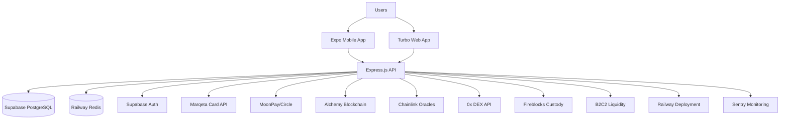

# Simplified MVP Architecture

### Technical Summary

DisCard implements a streamlined architecture using Expo for mobile development, Express.js backend, and Supabase for managed database and authentication. The system leverages established fintech infrastructure (Marqeta for card issuing, MoonPay/Circle for crypto conversion) while maintaining privacy through careful API design and data isolation. Railway provides simple deployment and scaling, while specialized crypto infrastructure (Fireblocks, Alchemy, Chainlink) handles complex blockchain operations. This approach prioritizes speed-to-market while building on battle-tested financial infrastructure.

### Platform and Infrastructure Choice

**Platform:** Railway (Platform-as-a-Service)

**Key Services:** 
- Railway for backend deployment and scaling
- Supabase for database, auth, and real-time features
- Railway Redis for caching and session management
- Sentry for error tracking and performance monitoring
- GitHub Actions for CI/CD automation

**Deployment Host and Regions:** Railway's global edge network with primary deployment in US regions, automatic scaling and geographic distribution

### Repository Structure

**Structure:** Monorepo using Turbo

**Monorepo Tool:** Turbo 1.x with simple configuration and fast builds

**Package Organization:** 
- `apps/mobile` - Expo React Native app
- `apps/web` - Turbo web application  
- `apps/api` - Express.js backend
- `packages/shared` - Shared types and utilities
- `packages/crypto` - Cryptocurrency utilities
- `packages/ui` - Shared UI components

### High Level Architecture Diagram

### Architectural Patterns

- **Backend-as-a-Service (BaaS):** Leverage Supabase for database, auth, and real-time features - _Rationale:_ Eliminates infrastructure complexity while providing enterprise features out of the box

- **API-First Design:** Express.js backend with RESTful APIs consumed by multiple frontends - _Rationale:_ Simple, predictable architecture that's easy to develop and debug

- **Managed Services Strategy:** Use specialized providers for complex features (Marqeta for cards, Fireblocks for custody) - _Rationale:_ Avoid reinventing financial infrastructure, faster time-to-market

- **Privacy Through Isolation:** Logical data separation without complex cryptographic schemes - _Rationale:_ Simpler to implement and audit while maintaining user privacy

- **Event-Driven Webhooks:** Real-time updates through webhook integrations with external services - _Rationale:_ Reliable state synchronization with financial service providers

