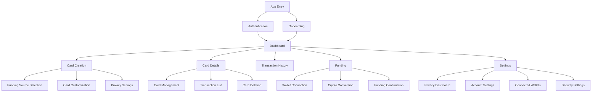
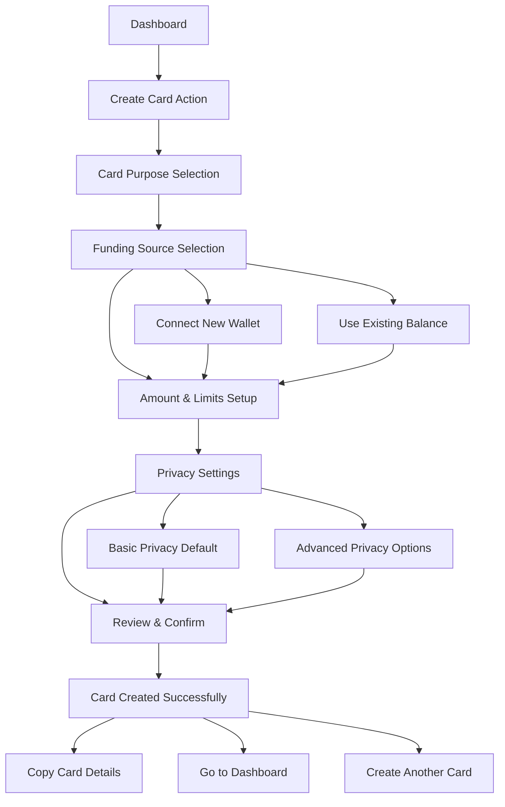
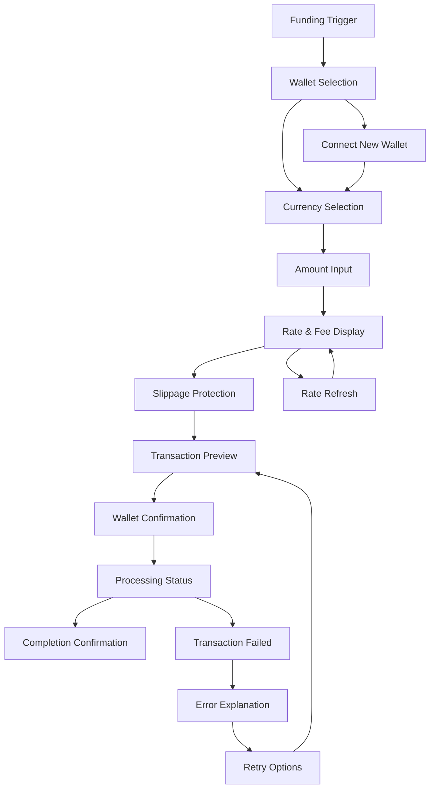
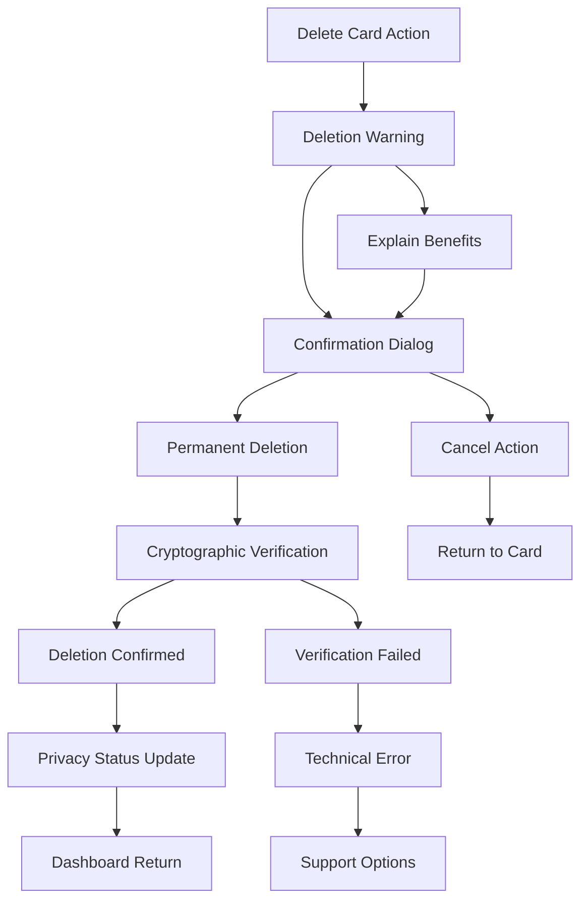

# DisCard UI/UX Specification

## Introduction

This document defines the user experience goals, information architecture, user flows, and visual design specifications for DisCard's user interface. It serves as the foundation for visual design and frontend development, ensuring a cohesive and user-centered experience that makes privacy protection intuitive and empowering.

The specification addresses the unique challenge of making disposable virtual cards feel natural to users while building trust in sophisticated privacy protections. Every design decision reinforces DisCard's core value proposition: true privacy through card disposability combined with seamless crypto spending.

### Overall UX Goals & Principles

#### Target User Personas

**Privacy-Conscious Crypto Holder (Primary):**
Technical professionals aged 25-45 with $10K+ in cryptocurrency holdings who actively use privacy tools (VPNs, privacy browsers) and are frustrated with existing crypto cards' privacy limitations. They value control, transparency, and sophisticated features but need efficient workflows for frequent use.

**Security-Focused Online Shopper (Secondary):**
Mainstream consumers aged 30-55 beginning to explore crypto who are primarily motivated by fraud protection and security. They need intuitive experiences with clear explanations of privacy benefits and simplified crypto integration.

#### Usability Goals

**Privacy Transparency:** Users understand exactly what privacy protections are active at all times, with clear visual indicators showing when transactions are isolated and when data is permanently deleted.

**Intuitive Disposability:** The concept of disposable cards feels natural and valuable rather than wasteful, with clear mental models for when and why to create/delete cards.

**Crypto Simplicity:** Cryptocurrency funding feels as straightforward as traditional payment methods, with complex blockchain operations abstracted behind simple interfaces.

**Trust Through Control:** Users feel confident in DisCard's privacy protection through hands-on control over their data, with transparency about what information is collected and when it's deleted.

#### Design Principles

1. **Privacy as Empowerment** - Privacy features feel like superpowers, not restrictions, giving users control and confidence
2. **Disposable by Design** - Visual language reinforces the temporary, ephemeral nature of cards while making it feel valuable
3. **Crypto Made Simple** - Complex blockchain operations presented through familiar financial interface patterns  
4. **Transparent Trust** - Build confidence through visibility into privacy protections and clear communication about data handling
5. **Progressive Disclosure** - Advanced features accessible but not overwhelming, allowing both simple and sophisticated use cases

### Change Log

| Date | Version | Description | Author |
|------|---------|-------------|--------|
| 2025-01-31 | 1.0 | Initial UI/UX specification | UX Expert |

## Information Architecture (IA)

### Site Map / Screen Inventory

### Navigation Structure

**Primary Navigation:** Bottom tab bar (mobile) / sidebar (desktop) with Dashboard, Create Card, Funding, History, and Settings. Emphasizes card creation as primary action through prominent placement and visual weight.

**Secondary Navigation:** Contextual actions within each screen including card management options, privacy controls, and quick funding actions. Card-specific actions grouped logically within card detail views.

**Breadcrumb Strategy:** Minimal breadcrumbs focusing on context clarity - users should always know which card they're managing and what privacy protections are active. Privacy status indicators persistent across navigation.

## User Flows

### Card Creation Flow

**User Goal:** Create a new disposable card for a specific purchase or use case

**Entry Points:** Dashboard quick action, primary navigation, post-transaction suggestion

**Success Criteria:** User successfully creates funded card with appropriate privacy settings and spending limits

#### Flow Diagram

#### Edge Cases & Error Handling:
- Insufficient crypto balance: Clear explanation with funding options
- Wallet connection failures: Retry options and alternative funding methods
- Network congestion: Fee estimation and delay warnings
- Rate fluctuation: Slippage protection with re-confirmation options

**Notes:** Flow emphasizes speed for frequent users while providing educational moments for new users. Privacy settings default to maximum protection with option to customize.

### Crypto Funding Flow

**User Goal:** Add cryptocurrency funds to account or specific card with confidence in conversion rates

**Entry Points:** Card creation, low balance notifications, manual funding action

**Success Criteria:** User successfully funds card with clear understanding of conversion rates and fees

#### Flow Diagram

#### Edge Cases & Error Handling:
- Rate changes during transaction: Re-confirmation with new rates
- Network failures: Clear status updates and retry mechanisms
- Wallet connection timeouts: Alternative connection methods
- Insufficient gas fees: Automatic fee calculation and funding suggestions

**Notes:** Flow prioritizes transparency in costs and timing while maintaining simplicity. Rate changes communicated clearly with user control over acceptance.

### Card Deletion Flow

**User Goal:** Permanently delete disposable card with confidence in data destruction

**Entry Points:** Card detail view, bulk management, post-transaction cleanup

**Success Criteria:** User deletes card with clear understanding of permanence and privacy benefits

#### Flow Diagram

#### Edge Cases & Error Handling:
- Active transactions: Warning about pending charges with delayed deletion option
- Network connectivity issues: Offline deletion queuing with confirmation when reconnected
- Verification failures: Technical support escalation with user privacy protection

**Notes:** Flow emphasizes the privacy benefits of deletion while ensuring users understand the irreversible nature. Clear visual feedback confirms successful data destruction.

## Wireframes & Mockups

### Design Files

**Primary Design Files:** Figma workspace with comprehensive component library, user flows, and interactive prototypes at [Design System URL - TBD]

### Key Screen Layouts

#### Dashboard - Card Overview

**Purpose:** Central hub for managing all disposable cards with immediate access to privacy status and key actions

**Key Elements:**
- Privacy status indicator showing active protections across all cards
- Card grid displaying active cards with visual status indicators (funded, active, low balance, expired)
- Quick create card floating action button with contextual suggestions
- Account balance summary with crypto breakdown and USD equivalent
- Recent activity feed with privacy-preserving transaction summaries

**Interaction Notes:** Cards display as visual objects that can be tapped for details, swiped for quick actions, and long-pressed for batch selection. Privacy indicators use consistent color coding and iconography.

**Design File Reference:** Dashboard-Overview-v1.fig

#### Card Creation - Funding Selection

**Purpose:** Streamlined card creation focusing on funding source selection with clear rate information

**Key Elements:**
- Connected wallet list with real-time balances and USD equivalents
- Currency selection with current conversion rates and 24-hour change indicators
- Amount input with dual display (crypto amount + USD equivalent)
- Fee breakdown showing network fees, conversion fees, and total cost
- Privacy settings toggle with clear explanations of protection levels

**Interaction Notes:** Real-time rate updates with visual indicators when rates change significantly. Wallet connection status clearly displayed with troubleshooting options for connection issues.

**Design File Reference:** Card-Creation-Funding-v1.fig

#### Card Details - Management Interface

**Purpose:** Comprehensive card management with transaction history and privacy controls

**Key Elements:**
- Card visual representation with copy-to-clipboard functionality for card details
- Privacy protection status with clear indicators of transaction isolation
- Transaction history specific to this card with merchant names and amounts
- Card controls including pause, limits adjustment, and deletion options
- Funding level indicator with quick add funds option

**Interaction Notes:** Card details secured behind biometric authentication or PIN. Deletion option requires multiple confirmations with clear warnings about permanence.

**Design File Reference:** Card-Details-Management-v1.fig

## Component Library / Design System

### Design System Approach

**Custom Design System** built specifically for DisCard's privacy-first financial application, incorporating established fintech patterns while introducing unique visual language for disposable cards and privacy protection. System emphasizes trust, security, and user empowerment through thoughtful typography, color, and interaction patterns.

### Core Components

#### DisposableCard Component

**Purpose:** Visual representation of virtual cards emphasizing their temporary nature while maintaining professional fintech aesthetics

**Variants:** 
- Active (fully funded and ready to use)
- Low Balance (needs funding with visual warning indicators)
- Expired (past expiration date with clear inactive state)
- Deleted (ghost state for recent deletions with privacy benefits messaging)

**States:** Default, Hover, Selected, Loading (during funding), Error (funding or network issues)

**Usage Guidelines:** Cards should feel substantial enough to convey trust while visually suggesting their ephemeral nature through design elements like subtle fade effects, dashed borders for expiring cards, and smooth deletion animations.

#### PrivacyIndicator Component

**Purpose:** Consistent visual communication of privacy protection status and transaction isolation

**Variants:**
- Active Protection (bright green with shield icon indicating full privacy)
- Partial Protection (amber with information icon for limited privacy scenarios)
- No Protection (red with warning icon for traditional payment method comparisons)
- Verification Status (blue with checkmark showing cryptographic deletion confirmation)

**States:** Loading, Active, Warning, Success, Error

**Usage Guidelines:** Always visible during card interactions, with hover/tap states providing detailed explanations of current privacy protections and benefits.

#### CryptoConverter Component

**Purpose:** Real-time cryptocurrency to USD conversion with transparent fee display

**Variants:**
- Compact (dashboard widget showing basic rates)
- Detailed (full conversion interface with fee breakdown)
- Historical (rate trends and timing information)

**States:** Loading rates, Current rates, Rate changed, Error loading, Network congestion warning

**Usage Guidelines:** Updates every 30 seconds with visual indicators when rates change significantly. Always shows total cost including all fees before user confirmation.

#### SecureDeletion Component

**Purpose:** Card deletion interface emphasizing privacy benefits and permanent nature

**Variants:**
- Warning Dialog (initial deletion confirmation with benefit explanation)
- Progress Indicator (cryptographic deletion in progress)
- Confirmation Display (successful deletion with privacy improvement messaging)

**States:** Warning, Processing, Success, Error, Verification Failed

**Usage Guidelines:** Multi-step confirmation process with clear privacy benefit messaging. Success state emphasizes improved privacy protection through permanent data destruction.

## Branding & Style Guide

### Visual Identity

**Brand Guidelines:** DisCard visual identity emphasizes security, privacy, and user empowerment through clean geometric design language that feels both technical and approachable. The brand conveys sophistication without intimidation, using familiar fintech patterns enhanced with privacy-focused visual elements.

### Color Palette

| Color Type | Hex Code | Usage |
|------------|----------|--------|
| Primary | #1B365D | Card backgrounds, primary actions, trust elements |
| Secondary | #2E8B57 | Privacy indicators, success states, secure actions |
| Accent | #4A90E2 | Interactive elements, links, information highlights |
| Success | #2ECC71 | Positive feedback, successful transactions, privacy active |
| Warning | #F39C12 | Cautions, rate changes, expiration warnings |
| Error | #E74C3C | Errors, security alerts, failed transactions |
| Neutral | #34495E, #7F8C8D, #BDC3C7, #ECF0F1 | Text, borders, backgrounds, disabled states |

### Typography

#### Font Families
- **Primary:** Inter (clean, modern, excellent readability for financial data)
- **Secondary:** SF Mono (monospace for card numbers, transaction IDs, crypto addresses)
- **Monospace:** Source Code Pro (technical information, cryptographic hashes)

#### Type Scale

| Element | Size | Weight | Line Height |
|---------|------|--------|-------------|
| H1 | 32px | 700 | 1.2 |
| H2 | 24px | 600 | 1.3 |
| H3 | 20px | 600 | 1.4 |
| Body | 16px | 400 | 1.5 |
| Small | 14px | 400 | 1.4 |

### Iconography

**Icon Library:** Lucide React for consistent, clean iconography with custom privacy-focused icons for unique DisCard concepts (disposable cards, transaction isolation, cryptographic deletion)

**Usage Guidelines:** Icons consistently sized at 16px, 20px, and 24px with proper color contrast. Privacy-related icons use distinctive visual language to build recognition and trust.

### Spacing & Layout

**Grid System:** 8px base unit grid system with responsive breakpoints at 768px (tablet) and 1024px (desktop)

**Spacing Scale:** 4px, 8px, 16px, 24px, 32px, 48px, 64px progression for consistent spatial relationships

## Accessibility Requirements

### Compliance Target

**Standard:** WCAG 2.1 AA compliance with enhanced focus on financial accessibility and privacy tool usability

### Key Requirements

**Visual:**
- Color contrast ratios: 4.5:1 minimum for normal text, 3:1 for large text and interactive elements
- Focus indicators: High-contrast 2px outline with 2px offset for all interactive elements
- Text sizing: Scalable up to 200% without horizontal scrolling or loss of functionality

**Interaction:**
- Keyboard navigation: Complete app functionality accessible via keyboard with logical tab order
- Screen reader support: Comprehensive ARIA labels, especially for privacy status and card states
- Touch targets: Minimum 44px touch targets with adequate spacing for motor accessibility

**Content:**
- Alternative text: Descriptive alt text for all privacy indicators, card status icons, and visual elements
- Heading structure: Logical heading hierarchy with proper semantic markup
- Form labels: Clear, descriptive labels for all form inputs with error messaging

### Testing Strategy

Automated accessibility testing integrated into development workflow using axe-core, manual testing with screen readers (VoiceOver, NVDA), keyboard-only navigation testing, and color blindness simulation testing.

## Responsiveness Strategy

### Breakpoints

| Breakpoint | Min Width | Max Width | Target Devices |
|------------|-----------|-----------|----------------|
| Mobile | 320px | 767px | iPhone, Android phones |
| Tablet | 768px | 1023px | iPad, Android tablets |
| Desktop | 1024px | 1440px | Laptops, small desktops |
| Wide | 1441px | - | Large monitors, ultra-wide displays |

### Adaptation Patterns

**Layout Changes:** Mobile-first responsive design with card grid adapting from single column (mobile) to 2-3 columns (tablet) to 4+ columns (desktop). Navigation transforms from bottom tabs (mobile) to sidebar (desktop).

**Navigation Changes:** Bottom tab bar on mobile transitions to left sidebar on desktop. Card creation remains prominent through floating action button (mobile) or dedicated sidebar action (desktop).

**Content Priority:** Transaction details condensed on mobile with expandable sections, full detail panels on desktop. Privacy indicators remain prominent across all breakpoints.

**Interaction Changes:** Touch-optimized interactions on mobile (swipe gestures, large touch targets) with hover states and keyboard shortcuts on desktop. Card management adapts from swipe actions (mobile) to right-click context menus (desktop).

## Animation & Micro-interactions

### Motion Principles

DisCard animations reinforce the concepts of privacy protection and card disposability through thoughtful motion design. Animations feel secure and controlled rather than playful, building trust through purposeful movement that communicates system status and user control.

### Key Animations

- **Card Creation:** Smooth fade-in with scale effect suggesting materialization, reinforcing the on-demand nature of disposable cards (Duration: 300ms, Easing: ease-out)
- **Card Deletion:** Controlled fade-out with slight scale reduction, followed by privacy benefit celebration animation (Duration: 500ms, Easing: ease-in)
- **Privacy Status Changes:** Subtle pulse animation on privacy indicators when protection status changes (Duration: 200ms, Easing: ease-in-out)
- **Rate Updates:** Gentle highlight animation when cryptocurrency rates update significantly (Duration: 150ms, Easing: ease-out)
- **Transaction Processing:** Progress indicators with secure, measured movement suggesting careful processing (Duration: variable, Easing: linear)

## Performance Considerations

### Performance Goals

- **Page Load:** Initial app load under 3 seconds on 3G networks
- **Interaction Response:** Card creation and management actions respond within 100ms
- **Animation FPS:** Maintain 60fps for all animations and transitions

### Design Strategies

Interface optimized for performance through efficient image formats (WebP), lazy loading for transaction history, and progressive enhancement for complex privacy features. Critical user paths prioritized for fastest loading with advanced features loaded asynchronously.

## Next Steps

### Immediate Actions

1. **Stakeholder Review:** Present UX specification to development team and key stakeholders for feedback and technical feasibility validation
2. **Design System Development:** Create comprehensive Figma component library with all defined components and interactive prototypes
3. **User Testing Plan:** Develop user testing protocol focusing on disposable card mental models and privacy feature comprehension
4. **Accessibility Audit:** Conduct initial accessibility review of design concepts with accessibility specialist consultation

### Design Handoff Checklist

- [x] All user flows documented with edge cases and error handling
- [x] Component inventory complete with variants and states
- [x] Accessibility requirements defined with specific testing criteria
- [x] Responsive strategy clear with breakpoint specifications
- [x] Brand guidelines incorporated with consistent visual language
- [x] Performance goals established with measurable criteria

## Checklist Results

*To be populated if UI/UX checklist becomes available*