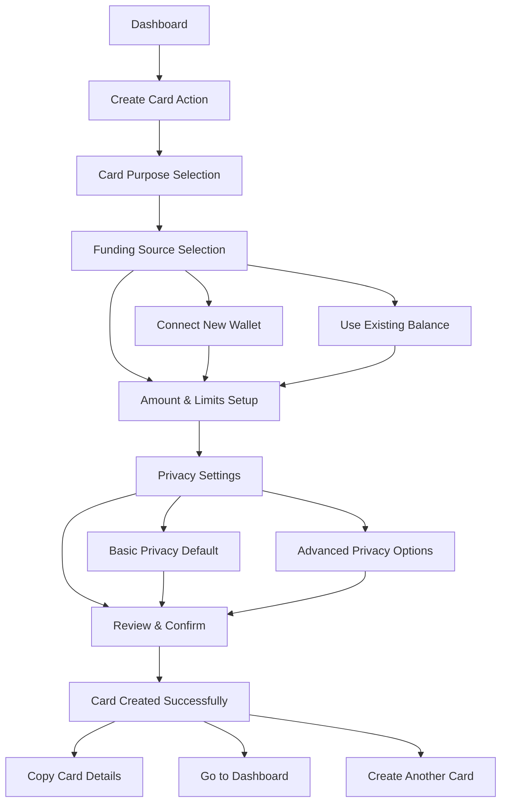
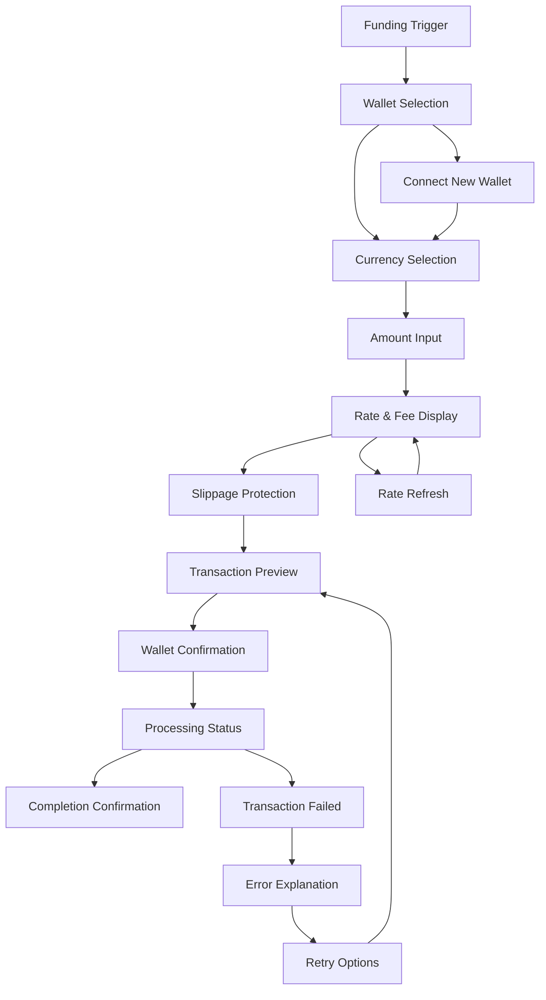
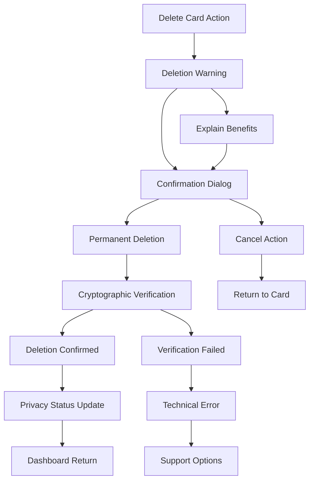

# User Flows

### Card Creation Flow

**User Goal:** Create a new disposable card for a specific purchase or use case

**Entry Points:** Dashboard quick action, primary navigation, post-transaction suggestion

**Success Criteria:** User successfully creates funded card with appropriate privacy settings and spending limits

#### Flow Diagram

#### Edge Cases & Error Handling:
- Insufficient crypto balance: Clear explanation with funding options
- Wallet connection failures: Retry options and alternative funding methods
- Network congestion: Fee estimation and delay warnings
- Rate fluctuation: Slippage protection with re-confirmation options

**Notes:** Flow emphasizes speed for frequent users while providing educational moments for new users. Privacy settings default to maximum protection with option to customize.

### Crypto Funding Flow

**User Goal:** Add cryptocurrency funds to account or specific card with confidence in conversion rates

**Entry Points:** Card creation, low balance notifications, manual funding action

**Success Criteria:** User successfully funds card with clear understanding of conversion rates and fees

#### Flow Diagram

#### Edge Cases & Error Handling:
- Rate changes during transaction: Re-confirmation with new rates
- Network failures: Clear status updates and retry mechanisms
- Wallet connection timeouts: Alternative connection methods
- Insufficient gas fees: Automatic fee calculation and funding suggestions

**Notes:** Flow prioritizes transparency in costs and timing while maintaining simplicity. Rate changes communicated clearly with user control over acceptance.

### Card Deletion Flow

**User Goal:** Permanently delete disposable card with confidence in data destruction

**Entry Points:** Card detail view, bulk management, post-transaction cleanup

**Success Criteria:** User deletes card with clear understanding of permanence and privacy benefits

#### Flow Diagram

#### Edge Cases & Error Handling:
- Active transactions: Warning about pending charges with delayed deletion option
- Network connectivity issues: Offline deletion queuing with confirmation when reconnected
- Verification failures: Technical support escalation with user privacy protection

**Notes:** Flow emphasizes the privacy benefits of deletion while ensuring users understand the irreversible nature. Clear visual feedback confirms successful data destruction.

