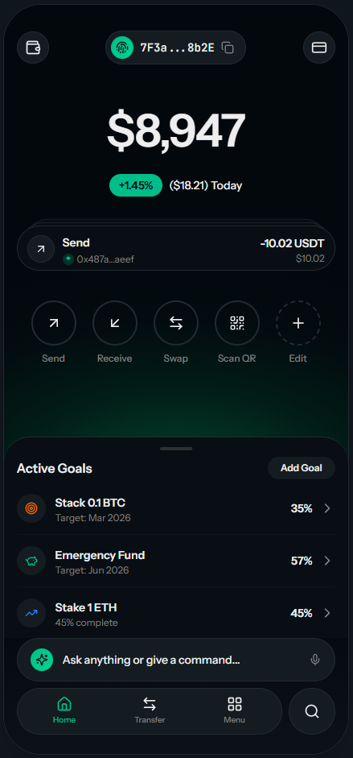

# DisCard

> Privacy-First Intent-Centric Super Wallet with Virtual Global Cards and Autonomous Financial Agents

[Presentation Video](https://youtu.be/L3Iys6N-02o)



[](LICENSE)
[](https://expo.dev)
[](https://convex.dev)
[](https://typescriptlang.org)
[](https://github.com/firedancer-io/firedancer)
[](https://forum.solana.com/t/simd-0326-proposal-for-the-new-alpenglow-consensus-protocol/4236)

DisCard is your autonomous financial agent that works 24/7. Set strategies, goals, and rules that your AI agents execute continuously in the background. Buy every dip, rebalance weekly, fund cards automatically, harvest yield; all while you sleep. When you need control, interact through natural language. Powered by dual-LLM security in TEE, DisCard combines privacy-by-default with always-on financial automation.

**Advanced tech, simple experience.** Despite sophisticated privacy tech (ZK proofs, MPC encryption, confidential transactions), DisCard abstracts complexity through AI and intuitive design, making it accessible to crypto newcomers and power users alike.


## Key Capabilities

### AI-Powered Interface
- **Natural Language Commands**: Just describe what you want. No crypto jargon required
- **Dual AI Security**: Two LLMs in Phala TEE - "Brain" (orchestrator) parses intents, "Soul" (your financial persona) executes - each validates the other
- **Smart Disambiguation**: Handles ambiguous commands with contextual follow-up questions
- **Guided Flows**: Step-by-step assistance for complex operations, explanations when you need them

### Frictionless Onboarding
- **No passwords**: Passkey and biometric authentication only
- **No seed phrases**: Turnkey handles key management securely
- **No KYC required**: Start instantly with Starpay prepaid cards
- **Natural language**: No crypto jargon to learn

### Autonomous Financial Agents
- **24/7 Execution**: Set strategies that run continuously - your wallet never sleeps
- **Goal-Based Automation**: "Stack 1 BTC by December" - agents find opportunities automatically
- **Smart Triggers**: Price alerts, rebalancing rules, auto-funding thresholds
- **Multi-Step Orchestration**: Complex workflows like "harvest → swap → fund card" execute atomically

### Privacy by Default
- **Private Deposits**: Auto-shield funds via single-use addresses. No link between KYC and spending
- **Private Cashout**: Unshield to fresh addresses with zero transaction history
- **Private P2P**: Zero-knowledge proof transfers via ShadowWire
- **ZK-Compressed State**: Light Protocol for privacy-preserving wallet state on Solana

### Instant Virtual Cards
- **Dual Card Providers**: Choose between Marqeta (reloadable Visa, KYC required) or Starpay (prepaid Mastercard, no KYC)
- **Disposable Cards**: Generate virtual debit and prepaid cards in seconds with crypto funding
- **Self-Healing**: Automatic card reissue when breach detected
- **Cryptographic Isolation**: No cross-card correlation possible
- **Real-time Fraud Detection**: Sub-800ms transaction analysis with 5 anomaly algorithms

### DeFi Native
- **Auto-Yield**: Idle funds automatically deployed to DeFi protocols, withdrawn seamlessly when needed
- **MEV-Protected Trading**: Jupiter DEX integration with DFlow order flow for best execution
- **Confidential Swaps**: Anoncoin for Solana swaps, SilentSwap for private cross-chain
- **Prediction Markets**: Private betting with encrypted amounts via PNP Exchange

## Design Philosophy

**You don't need to understand crypto to use it.**

DisCard packs sophisticated technology under the hood, but the AI co-pilot translates your intent into action:

| You say... | DisCard handles... |
|------------|-------------------|
| "Deposit $100" | MoonPay KYC, single-use address generation, auto-shielding to privacy pool |
| "Send $50 to Alice privately" | ZK-proof generation, ShadowWire transfer, recipient notification |
| "Create a travel card" | Marqeta virtual Visa creation, KYC verification, JIT funding setup |
| "Create an instant $200 prepaid card" | Starpay prepaid Mastercard, no KYC, privacy-preserving funding |
| "Swap my USDC for SOL" | Jupiter routing, MEV protection, DFlow order flow, slippage management |
| "Save for vacation" | Agent auto-transfers 10% of deposits, optimizes yield, tracks progress |
| "Stack 1 BTC by December" | Agent monitors prices, buys dips automatically, reports weekly progress |

**Built for everyone:**
- **Crypto newcomers**: Natural language interface, no jargon, guided flows that explain as they go
- **Power users**: Full control when you want it, advanced features accessible via commands
- **Developers**: Open architecture, extensible plugins, comprehensive API

## Features

### AI & Intent

| Feature | Description |
|---------|-------------|
| **Command Bar** | Natural language interface for all wallet operations |
| **Intent Parsing** | LLM-powered understanding of financial commands |
| **Dual AI Validation** | Brain + Soul mutual verification in Phala TEE |
| **Conversational Flows** | Multi-turn clarification for ambiguous requests |

### Autonomous Agents

| Feature | Description |
|---------|-------------|
| **24/7 Strategy Execution** | Agents run continuously, executing your DCA, rebalancing, and trading rules |
| **Goal-Based Planning** | Set financial goals; agents automatically work toward them |
| **Trigger System** | Price alerts, threshold triggers, time-based automation |
| **Auto-Funding** | Keep cards funded automatically when balance drops |
| **Yield Optimization** | Auto-deploy idle funds, harvest and compound automatically |
| **Multi-Step Workflows** | Chain complex operations that execute atomically |
| **Smart Monitoring** | Watch positions, alert on anomalies, auto-respond to conditions |

### Privacy

| Feature | Technology | Integration |
|---------|------------|-------------|
| **Private Deposits** | Auto-shield via single-use addresses | Privacy Cash + Turnkey |
| **Private Cashout** | Unshield to zero-history addresses | Privacy Cash + Turnkey |
| **Private P2P** | Zero-knowledge proof transfers | ShadowWire (Radr Labs) |
| **ZK State** | Compressed wallet state | Light Protocol |
| **Private Identity** | ZK credential proofs | Aztec + Arcium |
| **Selective Disclosure** | Prove "over 21" without revealing birthdate | Aztec Noir circuits |
| **Encrypted Credentials** | MPC-encrypted vault hides what verifications you have | Arcium MXE |
| **One-Time Payment Links** | Disposable payment URLs that expire after single claim | Convex + Solana Pay |
| **Confidential Balances** | Token-2022 confidential transfers | SPL Token Wrap |
| **Privacy Payments** | Alternative privacy-focused payment rails | Starpay |
| **TEE Authorization** | Sub-50ms card authorization in isolated TEE | MagicBlock Ephemeral Rollups |
| **Encrypted Balances** | TEE-based encrypted card balances (~50ms) | Inco Lightning |
| **Confidential Funding** | MPC-encrypted card funding + balance proofs | Arcium MXE |
| **On-Chain ZK Proofs** | Groth16 spending limit verification | Sunspot + Noir |
| **Stealth Addresses** | ECDH-derived disposable funding addresses | Hush |
| **Shielded Pools** | Hidden amounts for large transfers | Umbra |

### Cards & Payments

| Feature | Description |
|---------|-------------|
| **Dual Card Providers** | Marqeta (reloadable Visa, KYC) or Starpay (prepaid Mastercard, no KYC) |
| **Marqeta Cards** | Reloadable virtual Visa cards with JIT funding - funds stay shielded until you spend |
| **Starpay Cards** | Prepaid virtual Mastercard cards - no KYC required, instant issuance |
| **Crypto Funding** | Support for SOL, USDC, and major Solana tokens |
| **Self-Healing Cards** | Automatic reissue when breach detected |
| **Fraud Detection** | 5-algorithm analysis in sub-800ms |
| **MoonPay On-Ramp** | Buy crypto with card/bank, auto-convert to USDC |

### Identity & Verification

| Feature | Description | Integration |
|---------|-------------|-------------|
| **KYC Verification** | Identity verification with document + liveness checks | Civic |
| **DID Documents** | Decentralized identity anchored on Solana | DID:SOL |
| **Attestations** | Verifiable credentials (age, residency, accreditation) | Civic + Custom |
| **Biometric Auth** | Face/fingerprint verification for sensitive operations | Device biometrics |
| **Identity Recovery** | Social recovery with trusted guardians | Turnkey |
| **Selective Disclosure** | Prove claims without revealing underlying data | Aztec Noir |
| **Encrypted Storage** | Credentials stored in MPC-encrypted vault | Arcium MXE |

**Identity Flow:**
1. **Verify once** → Complete KYC via Civic (documents + liveness)
2. **Store privately** → Attestations encrypted in Arcium vault
3. **Prove selectively** → Generate ZK proofs for specific claims ("I'm over 21", "I'm not sanctioned")
4. **Control access** → You decide what to share, with whom, and when

### DeFi & Trading

| Feature | Technology | Integration |
|---------|------------|-------------|
| **Token Swaps** | MEV-protected execution | Jupiter + DFlow |
| **Confidential Swaps** | Encrypted order amounts | Anoncoin (Solana) |
| **Cross-Chain Swaps** | Shielded cross-chain transfers | SilentSwap |
| **Auto-Yield** | Idle fund deployment | DeFi protocols |
| **Shielded Yield** | MPC-encrypted positions | Arcium |
| **Prediction Markets** | Private bet amounts | PNP Exchange |
| **RWA Purchases** | Private tokenized assets | Anoncoin + Arcium |

## Architecture

```
discard/
+-- app/                    # Expo Router screens
|   +-- (tabs)/             # Main tabbed screens
|   |   +-- index.tsx       # Home/Dashboard
|   |   +-- card.tsx        # Cards management + creation
|   |   +-- holdings.tsx    # Asset holdings & portfolio
|   |   +-- transfer.tsx    # Send/receive transfers
|   +-- auth.tsx            # Passkey authentication
|   +-- buy-crypto.tsx      # MoonPay integration
|   +-- sell-crypto.tsx     # Crypto off-ramp
|   +-- history.tsx         # Transaction history
|   +-- identity.tsx        # KYC flow
|   +-- settings.tsx        # App settings
+-- components/             # React Native UI components
|   +-- command-bar.tsx     # Natural language command interface
|   +-- explore-view.tsx    # Token exploration with Jupiter data
|   +-- market-detail-screen.tsx
|   +-- token-detail-screen.tsx
|   +-- ui/                 # Shared UI components
+-- convex/                 # Backend (serverless functions + DB)
|   +-- schema.ts           # Database schema (13 tables)
|   +-- auth/               # Passkey authentication
|   +-- cards/              # Card management (Marqeta + Starpay)
|   |   +-- cards.ts        # Core card operations
|   |   +-- marqeta.ts      # Marqeta API (reloadable Visa)
|   |   +-- starpay.ts      # Starpay API (prepaid Mastercard)
|   |   +-- cardFunding.ts  # Privacy-preserving funding
|   +-- funding/            # Stripe + crypto funding
|   +-- intents/            # AI intent parsing
|   +-- fraud/              # Fraud detection engine
|   +-- privacy/            # Privacy Cash integration
|   +-- bridge/             # Turnkey integrations
|   +-- http.ts             # Webhook handlers
|   +-- crons.ts            # Scheduled jobs
+-- services/               # External API clients
|   +-- cardProviders/      # Card provider abstraction layer
|   |   +-- types.ts        # Shared provider interface
|   |   +-- index.ts        # Provider factory
|   |   +-- marqetaProvider.ts  # Marqeta implementation
|   |   +-- starpayProvider.ts  # Starpay implementation
|   +-- jupiterTokensClient.ts  # Jupiter token data
|   +-- jupiterUltraClient.ts   # Jupiter DEX swaps
|   +-- dflowClient.ts      # DFlow protocol integration
|   +-- dflowSwapClient.ts  # DFlow swap execution
|   +-- privacyCashClient.ts    # Privacy Cash shielding
|   +-- shadowWireClient.ts     # ShadowWire P2P
|   +-- arciumYieldClient.ts    # Arcium yield vaults
|   +-- brainClient.ts      # AI orchestrator
+-- programs/               # Solana smart contracts (Anchor)
|   +-- discard-state/      # ZK compressed card state PDAs
|   +-- discard-hooks/      # Token-2022 transfer hooks
|   +-- merchant-registry/  # On-chain merchant validation
+-- packages/               # elizaOS plugins
|   +-- plugin-financial-armor/  # Turnkey bridging + TEE
|   +-- plugin-brain-orchestrator/  # Intent parsing + planning
+-- hooks/                  # Convex data subscription hooks
+-- stores/                 # State management
+-- lib/                    # Utilities (passkeys, etc.)
+-- assets/                 # Icons, images, splash screens
+-- docs/                   # Architecture documentation
```

## Privacy Architecture

```
+-------------------------------------------------------------+
|  DISCARD PRIVACY ARCHITECTURE                               |
+-------------------------------------------------------------+
|                                                             |
|  DEPOSITS (MoonPay -> Shielded Balance)                     |
|  +-- Turnkey: Single-use deposit addresses (non-custodial)  |
|  +-- Privacy Cash: Auto-shield pool                         |
|  +-- Result: No link between KYC and wallet                 |
|                                                             |
|  CASHOUT (Shielded Balance -> Bank Account)                 |
|  +-- Privacy Cash: Unshield to single-use address           |
|  +-- Turnkey: Fresh address with zero history               |
|  +-- MoonPay: Receives from clean address                   |
|  +-- Result: No wallet history exposed to off-ramp          |
|                                                             |
|  P2P TRANSFERS (User -> User)                               |
|  +-- ShadowWire: ZK-proof private transfers                 |
|  +-- Result: No link between sender and receiver            |
|                                                             |
|  SPENDING (Shielded Balance -> Cards/Swaps/Bets/RWA)        |
|  +-- Light Protocol: ZK-compressed card state               |
|  +-- Inco Lightning: TEE encrypted balance operations       |
|  +-- Anoncoin: Confidential swaps (Solana)                  |
|  +-- SilentSwap: Private cross-chain swaps                  |
|  +-- PNP Exchange: Private prediction bets                  |
|  +-- Arcium: Confidential yield vaults + RWA storage        |
|                                                             |
|  IDENTITY (Private Credentials)                             |
|  +-- Aztec Noir: ZK proofs for credential claims            |
|  +-- Arcium: MPC-encrypted credential storage               |
|  +-- Result: Prove verification without revealing identity  |
|                                                             |
|  COMPLIANCE                                                 |
|  +-- Range: Wallet screening before transfers               |
|  +-- Phala TEE: Private sanctions checks (no plaintext)     |
|  +-- Result: OFAC compliant, privacy preserved              |
|                                                             |
|  COMPLETE PRIVACY LOOP:                                     |
|  Deposit (Address A) -> Shield -> Activity -> Unshield (B)  |
|       +------------------ NO CORRELATION ------------------+|
|                                                             |
+-------------------------------------------------------------+
```

## Tech Stack

### Frontend
- **React Native 0.81** + **Expo 54** - Cross-platform mobile app
- **Expo Router** - File-based navigation
- **TypeScript 5.9** - Type-safe development

### Backend
- **Convex** - Real-time database + serverless functions
- **Turnkey** - Non-custodial wallet infrastructure
- **Helius Firedancer RPC** - Optimized for Alpenglow sub-150ms confirmations

### Network Performance
- **Firedancer Ready** - Built for next-gen Solana validator client
- **Alpenglow Target** - 150ms transaction confirmation target
- **Multi-RPC Failover** - Automatic fallback for reliability
- **WebSocket Subscriptions** - Real-time confirmation tracking with 50ms polling fallback

### AI Layer
- **Dual LLM in Phala TEE** - Brain + Soul via elizaOS plugins
- **LLM** - Intent parsing, planning and analysis
- **WebAuthn Passkeys** - Hardware-bound authentication

### Privacy Layer
- **Privacy Cash** - Shielded deposit/cashout pool
- **ShadowWire** - ZK-proof P2P transfers
- **Light Protocol** - ZK state compression
- **Anoncoin** - Confidential token swaps
- **SilentSwap** - Private cross-chain swaps (Solana, Ethereum, Polygon, Avalanche)
- **Arcium** - MPC-encrypted DeFi + credential storage
- **Aztec** - Noir ZK circuits for private identity proofs + selective disclosure
- **Token-2022** - Confidential transfers via SPL Token Wrap
- **Starpay** - Privacy-focused payment rails
- **Solana Pay** - One-time payment links
- **MagicBlock** - TEE-secured ephemeral rollups for sub-50ms authorization
- **Sunspot** - On-chain Groth16 ZK proof verification
- **Hush** - ECDH stealth addresses for anonymous card funding
- **Umbra** - Shielded liquidity pools for large transfers
- **Inco Lightning** - TEE encrypted balances (~50ms spending checks)
- **Phala Network** - TEE for dual-LLM execution + private compliance checks

### DeFi & Trading
- **Jupiter** - DEX aggregation and swaps
- **DFlow** - MEV-protected order flow
- **PNP Exchange** - Private prediction markets

### Payments & Cards
- **Marqeta** - Reloadable virtual Visa cards (KYC required, JIT funding)
- **Starpay** - Prepaid virtual Mastercard cards (no KYC, instant issuance)
- **MoonPay** - Fiat on/off-ramp
- **Stripe** - Fiat funding + Treasury for IBANs (direct deposit)

### Identity
- **Civic** - KYC verification + attestations
- **DID:SOL** - Decentralized identity on Solana

### Compliance
- **Range** - Wallet screening + OFAC compliance

### Blockchain
- **Solana** - @solana/web3.js v1.98
- **Firedancer/Alpenglow** - Sub-150ms confirmation targeting
- **Anchor** - Smart contract framework
- **Token-2022** - Transfer hooks for policy enforcement

## Quick Start

### Prerequisites
- Node.js 18+
- Expo CLI (`npm install -g expo-cli`)
- Convex CLI (`npm install -g convex`)
- iOS Simulator or Android Emulator

### Installation

```bash
# Clone the repository
git clone https://github.com/YOUR_ORG/discard.git
cd discard

# Install dependencies
npm install

# Copy environment variables
cp .env.example .env.local
# Edit .env.local with your API keys

# Start Convex development server
npx convex dev

# In another terminal, start Expo
npm start
```

### Development Build (Required for Turnkey)

Turnkey passkeys require native modules not available in Expo Go:

```bash
# Create development build
npx expo prebuild

# Run on iOS
npx expo run:ios

# Run on Android
npx expo run:android
```

### Environment Variables

```env
# Convex
CONVEX_DEPLOYMENT=your_deployment
EXPO_PUBLIC_CONVEX_URL=https://your-deployment.convex.cloud

# Turnkey (Non-custodial wallets)
TURNKEY_ORGANIZATION_ID=your_org_id
TURNKEY_API_PRIVATE_KEY=your_private_key
TURNKEY_API_PUBLIC_KEY=your_public_key
EXPO_PUBLIC_TURNKEY_RP_ID=your_domain

# MoonPay (Fiat on-ramp)
MOONPAY_API_KEY=your_api_key
MOONPAY_SECRET_KEY=your_secret_key
EXPO_PUBLIC_MOONPAY_API_KEY=your_public_key

# Privacy Cash
PRIVACY_CASH_API_KEY=your_api_key
PRIVACY_CASH_POOL_ADDRESS=pool_address

# ShadowWire
SHADOWWIRE_API_KEY=your_api_key

# Helius (RPC)
HELIUS_API_KEY=your_api_key
HELIUS_RPC_URL=your_rpc_url

# Range (Compliance)
RANGE_API_KEY=your_api_key

# Card Issuing (Marqeta - Reloadable Visa, KYC)
MARQETA_BASE_URL=https://sandbox-api.marqeta.com/v3
MARQETA_APPLICATION_TOKEN=your_token
MARQETA_ACCESS_TOKEN=your_token

# Card Issuing (Starpay - Prepaid Mastercard, No KYC)
STARPAY_API_URL=https://api.starpay.cards/v1
STARPAY_API_KEY=your_api_key

# Payments (Stripe)
STRIPE_SECRET_KEY=sk_test_...
STRIPE_WEBHOOK_SECRET=whsec_...

# AI (Phala Redpill)
REDPILL_API_KEY=your_key

# Blockchain
SOLANA_RPC_URL=https://api.mainnet-beta.solana.com
```

## Basic Intents

The command bar understands natural language:

**Cards & Payments**
- "Create a card with $50 limit" - Creates a Marqeta reloadable Visa (KYC required)
- "Create an instant prepaid card with $100" - Creates a Starpay prepaid Mastercard (no KYC)
- "Fund my travel card with $100"
- "Freeze my Amazon card"
- "What's my total balance across all cards?"

**Deposits & Withdrawals**
- "Deposit $100" - Private deposit via MoonPay
- "Withdraw $50 to bank" - Private cashout
- "Top up $200 with MoonPay"
- "Show me my IBAN for bank transfers"

**Transfers & P2P**
- "Send $25 to @alice"
- "Transfer $50 from shopping to groceries card"

**Trading & DeFi**
- "Swap 100 USDC for SOL"
- "Swap 100 USDC from Solana to Ethereum" - Private cross-chain via SilentSwap
- "Show me trending tokens"
- "Buy $100 of ETH"
- "Buy $1000 USDY" - Private RWA purchase

**Predictions**
- "Bet $10 on SOL hitting $300"

## Complex Intents

Your wallet works 24/7. Set up strategies, monitoring, and automation that run continuously:

**Trading Bots & DCA**
- "DCA $100 into SOL every Monday"
- "Buy SOL whenever it drops 10% from weekly high"
- "Auto-swap any USDT I receive into USDC"

**Monitoring & Alerts**
- "Alert me when SOL breaks $200"
- "Notify me if any card has unusual spending"
- "Watch my yield positions and alert if APY drops below 5%"

**Auto-Management**
- "Keep my Netflix card funded with at least $20"
- "Auto-deploy any balance over $1000 to highest yield"
- "Rebalance to 60% SOL / 40% stables weekly"

**Goal-Based Automation**
- "Stack 1 BTC by December - buy dips automatically"
- "Save $5000 for vacation - auto-transfer 10% of deposits"
- "Build emergency fund to $10k - optimize for low-risk yield"

**Complex Multi-Step**
- "Harvest all yield, swap to USDC, fund my travel card"
- "When I receive over $500: 50% to savings, 30% to yield, 20% to spending card"
- "Close my smallest 3 DeFi positions and consolidate into SOL"

## Sponsor Integrations

DisCard integrates with the following sponsors and technologies:

| Category | Sponsor | Integration |
|----------|---------|-------------|
| **Private Payments** | Privacy Cash | Deposit shielding + cashout unshielding |
| **Private P2P** | Radr Labs (ShadowWire) | Zero-knowledge proof transfers |
| **Private Swaps** | Anoncoin | Confidential swap execution + RWA purchases |
| **Private Cross-Chain** | SilentSwap | Shielded cross-chain swaps |
| **Private DeFi** | Arcium | Shielded yield vaults + encrypted credential storage |
| **Private Identity** | Aztec | Noir ZK proofs for selective disclosure |
| **ZK Compression** | Light Protocol | Compressed wallet state on Solana |
| **TEE Authorization** | MagicBlock | Sub-50ms card authorization in ephemeral rollups |
| **On-Chain ZK Verification** | Sunspot | Groth16 spending limit proofs |
| **Stealth Addresses** | Hush | ECDH disposable funding addresses |
| **Shielded Pools** | Umbra | Hidden amounts for large transfers |
| **Encrypted Balances** | Inco | TEE-based encrypted card balances for agent operations |
| **TEE Execution** | Phala Network | Dual-LLM execution + private compliance/sanctions checks |
| **Compliance** | Range | Wallet screening + OFAC compliance |
| **RPC Infrastructure** | Helius | Firedancer RPC + Alpenglow 150ms confirmations |
| **Wallet Infrastructure** | Turnkey | Non-custodial passkey wallets |
| **Prediction Markets** | PNP Exchange | Private prediction bets |
| **Privacy Payment Rails** | Starpay | Alternative privacy-focused payments + DeFi |
| **Confidential Tokens** | Token-2022 | SPL Token Wrap for confidential balances |
| **Identity Verification** | Civic | KYC, attestations, liveness checks |

## Security

- **Non-custodial**: User controls all keys via passkey
- **Dual AI Validation**: Brain + Soul mutual verification prevents single point of failure
- **Policy-limited**: Session keys restricted to specific actions
- **Audited dependencies**: Privacy Cash, ShadowWire, Light Protocol
- **Compliant**: Range wallet screening for OFAC
- **Hardware-bound keys**: Via Secure Enclave / StrongBox
- **No passwords**: Biometric authentication only
- **Real-time monitoring**: Sub-second fraud detection

For security issues, email security@discard.app (do not open public issues).

## Contributing

We welcome contributions! See [CONTRIBUTING.md](CONTRIBUTING.md) for guidelines.

## License

MIT License - see [LICENSE](LICENSE)

## Acknowledgments

**Submitted to:**
- [Solana Privacy Hack 2026](https://solana.com/privacyhack)
- [Colosseum Eternal](https://www.colosseum.org/eternal)

**Privacy Integrations:**
- [Privacy Cash](https://privacycash.co) - Shielded deposits + cashout
- [Radr Labs](https://radrlabs.io) - ShadowWire P2P
- [Light Protocol](https://lightprotocol.com) - ZK compression
- [Arcium](https://arcium.com) - Confidential DeFi + encrypted credential storage
- [Anoncoin](https://anoncoin.io) - Private swaps + RWA purchases
- [SilentSwap](https://silentswap.io) - Private cross-chain swaps
- [Aztec](https://aztec.network) - Private Identity ZK proofs + selective disclosure
- [PNP Exchange](https://pnp.exchange) - Private predictions
- [Starpay](https://starpay.com) - Privacy payment rails
- [MagicBlock](https://magicblock.gg) - TEE-secured ephemeral rollups
- [Sunspot](https://github.com/solana-foundation/noir-examples) - On-chain Groth16 verification
- [Hush](https://hushwallet.io) - Stealth addresses
- [Umbra](https://umbra.cash) - Shielded liquidity pools
- [Inco](https://inco.org) - TEE encrypted balance operations

**Infrastructure:**
- [Turnkey](https://turnkey.com) - Non-custodial wallets
- [Helius](https://helius.dev) - Firedancer RPC + Alpenglow confirmations
- [Range](https://range.org) - Compliance
- [Civic](https://civic.com) - Identity verification
- [Convex](https://convex.dev) - Real-time backend
- [Phala Network](https://phala.network) - TEE infrastructure + compliance enclaves

**Additional Resources:**
- [Expo Documentation](https://docs.expo.dev)
- [Jupiter API](https://station.jup.ag/docs)
- [DFlow Protocol](https://docs.dflow.net)
- [Marqeta Docs](https://www.marqeta.com/docs)
- [MoonPay Docs](https://docs.moonpay.com)

---

**DisCard** - Intent-Centric Super Wallet
*Autonomous agents. Privacy by default. Cards in seconds. Your wealth on autopilot.*
