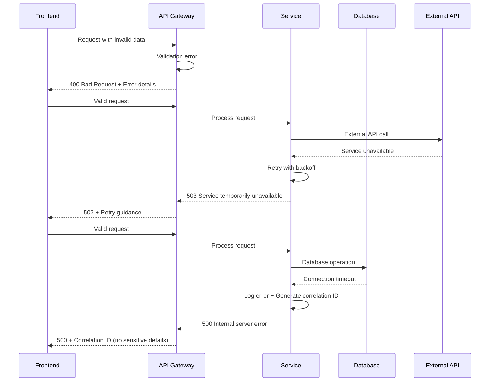

# Error Handling Strategy

### Unified Error Flow



### Error Response Format

```typescript
interface ApiError {
  error: {
    code: string;           // Machine-readable error code
    message: string;        // User-friendly error message
    details?: Record<string, any>; // Additional context (non-sensitive)
    timestamp: string;      // ISO 8601 timestamp
    correlationId: string;  // For support troubleshooting
    retryable?: boolean;    // Whether client should retry
  };
}
```

### Frontend Error Handling

```typescript
// Global error boundary for React components
export class ErrorBoundary extends React.Component<Props, State> {
  static getDerivedStateFromError(error: Error): State {
    // Never expose sensitive information in error UI
    return {
      hasError: true,
      errorId: generateErrorId(),
      userMessage: 'Something went wrong. Please try again.'
    };
  }

  componentDidCatch(error: Error, errorInfo: ErrorInfo) {
    // Log to privacy-compliant error tracking
    logError(error, {
      ...errorInfo,
      sensitive: false, // Never log sensitive data
      userId: getCurrentUserId(), // Only if consent given
    });
  }
}

// API error handling with retry logic
export const apiClient = {
  async request<T>(config: RequestConfig): Promise<T> {
    try {
      return await this.executeRequest<T>(config);
    } catch (error) {
      if (error.status === 401) {
        // Handle authentication errors
        await this.refreshToken();
        return this.executeRequest<T>(config);
      } else if (error.status >= 500 && config.retryable !== false) {
        // Retry server errors with exponential backoff
        return this.retryRequest<T>(config);
      }
      throw this.normalizeError(error);
    }
  }
};
```

### Backend Error Handling

```typescript
// Global error handler middleware
export const errorHandler = (
  error: Error,
  req: FastifyRequest,
  reply: FastifyReply,
  next: any
) => {
  const correlationId = req.headers['x-correlation-id'] || generateId();
  
  // Log error with privacy protections
  logger.error('Request failed', {
    correlationId,
    error: error.message,
    stack: error.stack,
    path: req.url,
    method: req.method,
    // Never log sensitive request data
    sensitive: false
  });

  // Determine appropriate user-facing error
  if (error instanceof ValidationError) {
    reply.status(400).send({
      error: {
        code: 'VALIDATION_ERROR',
        message: 'Invalid request data',
        details: error.details, // Safe validation details only
        timestamp: new Date().toISOString(),
        correlationId
      }
    });
  } else if (error instanceof AuthenticationError) {
    reply.status(401).send({
      error: {
        code: 'AUTHENTICATION_REQUIRED',
        message: 'Authentication required',
        timestamp: new Date().toISOString(),
        correlationId
      }
    });
  } else {
    // Generic server error - never expose internal details
    reply.status(500).send({
      error: {
        code: 'INTERNAL_ERROR',
        message: 'An unexpected error occurred',
        timestamp: new Date().toISOString(),
        correlationId,
        retryable: true
      }
    });
  }
};
```

