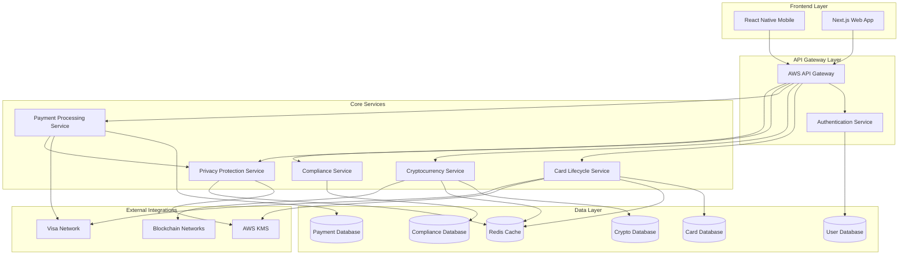

# Components

### Card Lifecycle Service

**Responsibility:** Manages complete disposable card lifecycle from creation through cryptographic deletion with privacy-preserving isolation

**Key Interfaces:**
- POST /cards - Create new disposable card with custom limits and restrictions
- DELETE /cards/{id} - Permanent deletion with cryptographic verification
- GET /cards/{id}/privacy-status - Real-time privacy protection verification

**Dependencies:** KMS for encryption keys, Visa API for card provisioning, Redis for session state

**Technology Stack:** Node.js with Fastify, PostgreSQL with row-level security, AWS KMS integration, cryptographic libraries for deletion verification

### Cryptocurrency Integration Service

**Responsibility:** Multi-blockchain integration with real-time conversion rates, wallet connectivity, and transaction monitoring across BTC, ETH, and ERC-20 tokens

**Key Interfaces:**
- GET /crypto/rates - Real-time conversion rates with slippage protection
- POST /crypto/fund - Initiate cryptocurrency funding with conversion
- GET /crypto/transactions/{id} - Monitor blockchain confirmation status

**Dependencies:** Blockchain node connections, exchange APIs for rates, wallet integration SDKs

**Technology Stack:** Node.js with Web3.js and BitcoinJS, Redis for rate caching, webhook handlers for blockchain events, multi-chain monitoring

### Payment Processing Service

**Responsibility:** Visa network integration for transaction authorization with real-time processing and fraud detection while maintaining privacy isolation

**Key Interfaces:**
- POST /payments/authorize - Process Visa authorization requests
- GET /payments/transactions - Retrieve card-specific transaction history
- POST /payments/dispute - Handle transaction disputes and chargebacks

**Dependencies:** Visa Direct API, fraud detection algorithms, transaction monitoring systems

**Technology Stack:** Node.js with payment SDK integration, PostgreSQL for transaction records, real-time event processing, secure API communication

### Privacy Protection Service

**Responsibility:** Enforces transaction isolation, manages cryptographic deletion, and provides privacy verification across all system components

**Key Interfaces:**
- GET /privacy/isolation-status - Verify transaction isolation effectiveness
- POST /privacy/verify-deletion - Cryptographic proof of data destruction
- GET /privacy/audit-trail - Privacy-compliant audit reporting

**Dependencies:** All other services for privacy enforcement, KMS for key management, audit logging systems

**Technology Stack:** Node.js with cryptographic libraries, AWS KMS integration, privacy-preserving analytics, compliance reporting tools

### Component Diagrams


