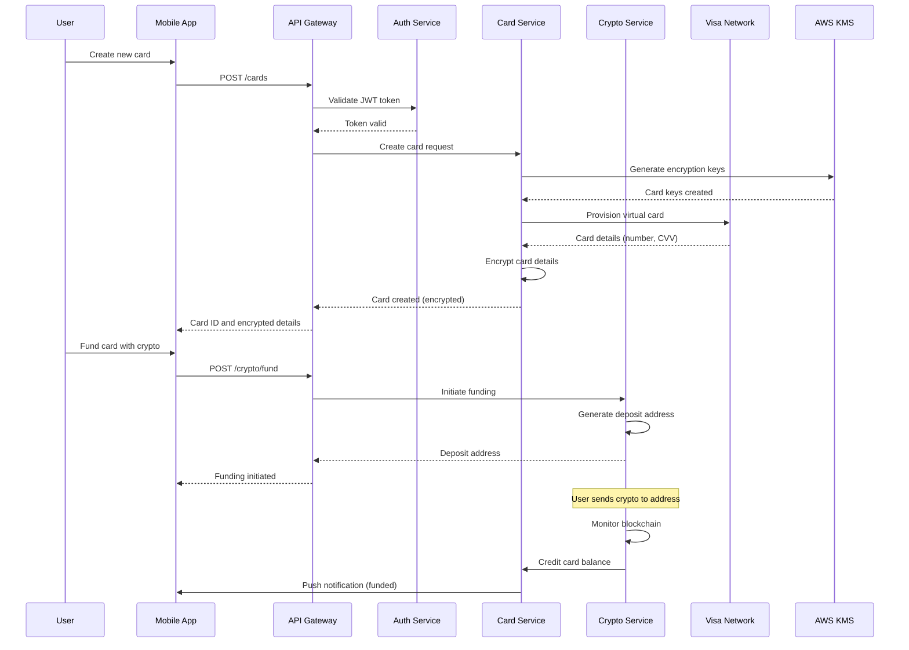
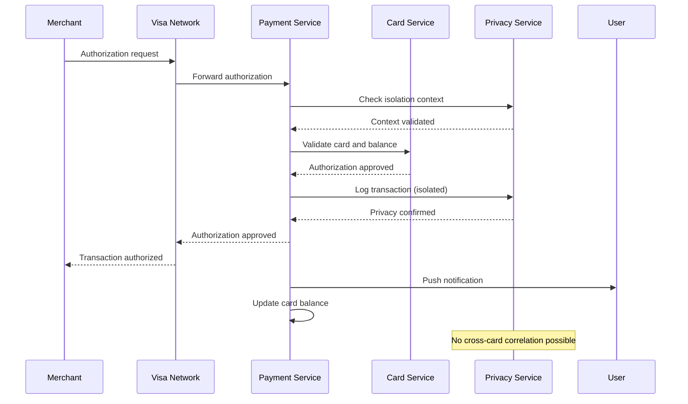

# Core Workflows

### Card Creation and Funding Workflow

```mermaid
sequenceDiagram
    participant User
    participant Mobile as Mobile App
    participant API as API Gateway
    participant Auth as Auth Service
    participant Card as Card Service
    participant Crypto as Crypto Service
    participant Visa as Visa Network
    participant KMS as AWS KMS
    
    User->>Mobile: Create new card
    Mobile->>API: POST /cards
    API->>Auth: Validate JWT token
    Auth-->>API: Token valid
    
    API->>Card: Create card request
    Card->>KMS: Generate encryption keys
    KMS-->>Card: Card keys created
    Card->>Visa: Provision virtual card
    Visa-->>Card: Card details (number, CVV)
    Card->>Card: Encrypt card details
    Card-->>API: Card created (encrypted)
    API-->>Mobile: Card ID and encrypted details
    
    User->>Mobile: Fund card with crypto
    Mobile->>API: POST /crypto/fund
    API->>Crypto: Initiate funding
    Crypto->>Crypto: Generate deposit address
    Crypto-->>API: Deposit address
    API-->>Mobile: Funding initiated
    
    Note over Crypto: User sends crypto to address
    Crypto->>Crypto: Monitor blockchain
    Crypto->>Card: Credit card balance
    Card->>Mobile: Push notification (funded)
```

### Privacy-Preserving Transaction Processing

```mermaid
sequenceDiagram
    participant Merchant
    participant Visa as Visa Network
    participant Payment as Payment Service
    participant Card as Card Service
    participant Privacy as Privacy Service
    participant User
    
    Merchant->>Visa: Authorization request
    Visa->>Payment: Forward authorization
    Payment->>Privacy: Check isolation context
    Privacy-->>Payment: Context validated
    
    Payment->>Card: Validate card and balance
    Card-->>Payment: Authorization approved
    Payment->>Privacy: Log transaction (isolated)
    Privacy-->>Payment: Privacy confirmed
    
    Payment-->>Visa: Authorization approved
    Visa-->>Merchant: Transaction authorized
    
    Payment->>User: Push notification
    Payment->>Payment: Update card balance
    
    Note over Privacy: No cross-card correlation possible
```

