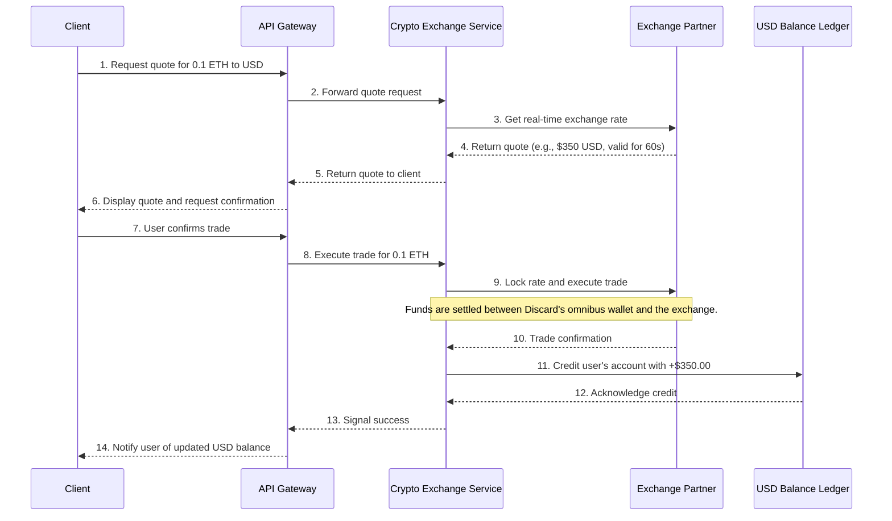
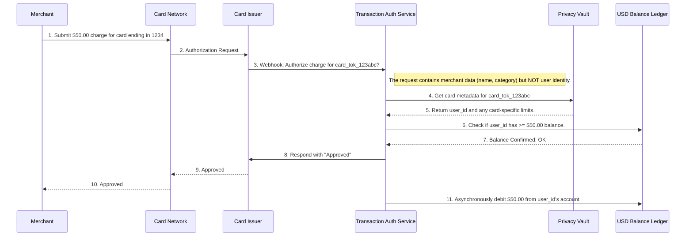

# Discard Protocol: Technical Architecture
## Crypto-to-USD Conversion, Card Provisioning, and Privacy Protection

### 1. Overview

This document outlines the technical architecture of the Discard platform, focusing on three core functionalities:
1.  **Crypto-to-USD Conversion:** The process of converting a user's cryptocurrency into a spendable USD balance.
2.  **Virtual Card Provisioning:** The creation and management of single-use or multi-use virtual debit cards.
3.  **Privacy Protection:** The mechanisms that anonymize spending and decouple a user's on-chain identity from their off-chain merchant transactions.

The architecture is designed around a microservices model to ensure scalability, security, and maintainability. The core design principles are **security-first**, **privacy-by-design**, and **regulatory compliance**.

### 2. System Components

The system is composed of several key services that interact via a combination of synchronous REST/gRPC APIs and an asynchronous message queue for reliability.

```mermaid
graph TD
    subgraph "User Layer"
        A[Client Application (Web/Mobile)]
    end

    subgraph "Core Services"
        B[API Gateway]
        C[User & Auth Service]
        D[USD Balance Ledger]
    end

    subgraph "Financial Services"
        E[Crypto Exchange Service]
        F[Card Provisioning Service]
        G[Transaction Authorization Service]
    end

    subgraph "Privacy Layer"
        H[Privacy Vault & Anonymization Engine]
    end

    subgraph "Third-Party Integrations"
        I[Crypto Exchange Partner API]
        J[Card Issuer & Processor API (e.g., Stripe, Marqeta)]
        K[KYC/AML Verification Service]
    end

    A --> B
    B --> C
    B --> D
    B --> E
    B --> F
    B --> G
    C --> K
    E --> I
    F --> J
    G --> J
    E --> D
    G --> D
    F --> H
    G --> H
```

-   **Client Application:** The user-facing interface where all actions are initiated.
-   **API Gateway:** The single, authenticated entry point for all client requests. It routes traffic to the appropriate downstream service.
-   **User & Auth Service:** Manages user identity, authentication (e.g., OAuth2, MFA), and KYC/AML status.
-   **USD Balance Ledger:** A highly reliable, immutable ledger that tracks the user's USD balance. This is the source of truth for spending capacity.
-   **Crypto Exchange Service:** Handles all interactions with third-party cryptocurrency exchanges, including fetching quotes and executing trades.
-   **Card Provisioning Service:** Manages the lifecycle of virtual cards (creation, freezing, deletion) via the card issuer's API.
-   **Transaction Authorization Service:** Responds to real-time authorization requests from the card network when a user makes a purchase.
-   **Privacy Vault & Anonymization Engine:** The core of Discard's privacy promise. It stores sensitive card data in a PCI-DSS compliant vault and contains the logic to break the link between the funding source and the purchase.

### 3. Flow 1: Crypto-to-USD Conversion

This flow describes how a user converts `0.1 ETH` into a spendable USD balance.



**Key Points:**
-   **Omnibus Wallet:** Discard manages institutional omnibus wallets. The user's crypto is not sent directly from their personal on-chain wallet to the exchange for each trade, obfuscating the source of funds.
-   **Rate Locking:** Quotes are time-limited to protect against slippage.
-   **Atomicity:** The crediting of the user's USD balance is contingent on a successful trade confirmation from the exchange partner.

### 4. Flow 2: Virtual Card Provisioning & Transaction

This flow shows how a user creates a card and makes a purchase, highlighting the privacy mechanisms.

**Part A: Card Provisioning**
1.  **Request:** User requests a new virtual card from the Client App, specifying a name (e.g., "Online Shopping") and an optional spending limit.
2.  **API Call:** The Client calls the `API Gateway`, which routes the request to the `Card Provisioning Service`.
3.  **Issuer Interaction:** The `Card Provisioning Service` calls the `Card Issuer API` (e.g., Stripe) to create a new virtual card.
4.  **Data Storage:** The full card details (PAN, CVV, Expiry) are returned by the issuer. The `Card Provisioning Service` immediately sends this data to the **`Privacy Vault`** for secure, PCI-DSS compliant storage. The service itself does not retain the full PAN.
5.  **Tokenization:** The `Privacy Vault` returns a non-sensitive token (e.g., `card_tok_123abc`) to the `Card Provisioning Service`, which is associated with the user's account.
6.  **Client Display:** The token is used to fetch and display the card details securely within the Client App for the user to copy and use.

**Part B: Merchant Transaction**


### 5. Privacy Protection Deep Dive

The core of Discard's privacy is the architectural separation of *who* is spending from *what* is being bought.

1.  **Decoupled Ledger:** The `USD Balance Ledger` only knows a `user_id` and a `balance`. It has no knowledge of merchant names, locations, or card numbers.
2.  **Anonymization by Default:** The `Transaction Authorization Service` is the only component that sees merchant data during a transaction. It is designed to be stateless. It receives a request, checks the balance against the user ID provided by the `Privacy Vault`, and gives a yes/no answer. It does not log or store the merchant details against the user's permanent record.
3.  **No Data Correlation:** Because the crypto conversion happens in a separate flow and funds a generic USD balance, there is no direct data trail from an on-chain transaction (e.g., a `deposit ETH` event) to an off-chain merchant purchase (e.g., "a coffee shop").
4.  **PCI-DSS Compliance:** All sensitive card data (PAN, CVV) is isolated within the `Privacy Vault`, which is built to strict PCI-DSS standards, drastically reducing the compliance scope of other services.

### 6. Security & Compliance

-   **Encryption:** All data is encrypted in transit using TLS 1.3 and at rest using AES-256. Database fields containing PII are further encrypted at the application layer.
-   **Authentication:** All internal service-to-service communication is authenticated using mutual TLS (mTLS). User authentication is enforced at the API Gateway.
-   **KYC/AML:** Users must complete identity verification with a trusted partner before they can convert crypto or provision cards. This is a legal requirement to prevent money laundering.
-   **Rate Limiting & Monitoring:** Strict rate limiting is applied at the API Gateway. All services produce structured logs and metrics to monitor for anomalous or malicious activity.
