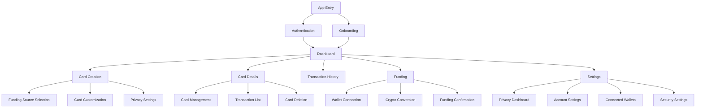

# Information Architecture (IA)

### Site Map / Screen Inventory

### Navigation Structure

**Primary Navigation:** Bottom tab bar (mobile) / sidebar (desktop) with Dashboard, Create Card, Funding, History, and Settings. Emphasizes card creation as primary action through prominent placement and visual weight.

**Secondary Navigation:** Contextual actions within each screen including card management options, privacy controls, and quick funding actions. Card-specific actions grouped logically within card detail views.

**Breadcrumb Strategy:** Minimal breadcrumbs focusing on context clarity - users should always know which card they're managing and what privacy protections are active. Privacy status indicators persistent across navigation.

